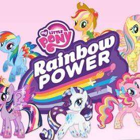

# written with python3(3.5.2) and django

## Basic Tut's
after django-admin startproject 'projectname';

1) python3 manage.py startapp 'filename'

2) go to settings.py and install app(s)

3) go to urls.py and set path and url

### About this

Created the mini blog/diary for myself with minimum css/scss to learn about web dev environment in python-django framework

(tutorial link is below)

####*stretch goal*: add more css, fontawesome and other library to make it more visually dynamic/enticing

[adapted from youTube tutorial](https://www.youtube.com/channel/UCfzlCWGWYyIQ0aLC5w48gBQ)

1)```python3 manage.py runserver```

2) type in the URL's in the browser for the website
